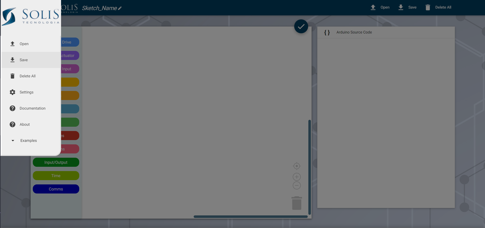

# Soblockly
Soblockly is a visual programming editor for Arduino. It is a fork of [Ardublockly][3] and based on Google's [Blockly][1], which has been forked to generate [Arduino][4] code.

Soblockly was designed to be used by students aged between 8 and 15. So that you can program the MiniSobot quickly and easily .  


![Ardublockly desktop program screenshot][desktop_screeshot]


## Features
The `ArdublocklyServer` Python package initialises a local server to be able to compile and load the Arduino code using the [Arduino IDE][2] and [Arduino CLI][6].

* Blocks integration with [MiniSobot-ArduinoLibrary][7]
* Grouping Blocks in colors
* Generates Arduino code with visual drag-and-drop blocks
* Uploads the code to an Arduino Board
* Useful "code block warnings"
* Compatible with a wide range of official Arduino Boards
* Works on Windows, other OSs will be implemented in the future...

## Installing 
The desktop application is currently available for Windows. And there are two ways to install the program:
 * Full installation, this method contains all the necessary programs;
 * Source, downloads all the Soblockly files and others needed programs;

Needed programs::

* [Arduino IDE 2.3.2](https://www.arduino.cc/en/software)
* [Arduino CLI 0.35.3](https://github.com/arduino/arduino-cli/releases/tag/v0.35.3) 
* [Python 3.6.8](https://www.python.org/downloads/release/python-368/)

Arduino CLI already togheter Arduino IDE in latest versions.


### Full installation
To run the full installation, go to the [releases page](https://github.com/SolisTecnologia/Soblockly/releases) and download the setup-full-installation.exe file. This is recommended installation method because there are not many configuration procedures after installation. Just:

 Download >> Execute the .exe >> Start the Soblockly

### Source Installing

If you prefer to install the above programs or if you already have them on your computer, simply install the source code or run the git clone:

```
git clone https://github.com/SolisTecnologia/SoBlockly.git
cd Soblockly

python start.py
```

In Soblockly acess de configuration pages and set the path to your Arduino IDE.
```
Eg: C:\Users\Programs\Arduino IDE\Arduino IDE.exe
```




## Credit
This project it is a fork of [Ardublockly][3].
And has been inspired by [DB4K][5] another brazilian project for students. 
![DB4K desktop program screenshot][DB4K_logo]

Blockly original source is Copyright of Google Inc. [https://developers.google.com/blockly/][1].

A list of changes to the Blockly fork can be found in the [Blockly subdirectory README][17] file.

In this project the changed parts have this comment ( Modified by RLC Solis Tecnologia)
 
## License
Unless stated otherwise, the source code of this projects is
licensed under the Apache License, Version 2.0 (the "License");
you may not use any of the licensed files within this project
except in compliance with the License.

The full document can be found in the [LICENSE][9] file.

Unless required by applicable law or agreed to in writing, software
distributed under the License is distributed on an "AS IS" BASIS,
WITHOUT WARRANTIES OR CONDITIONS OF ANY KIND, either express or implied.
See the License for the specific language governing permissions and
limitations under the License.

## Reference Link
[Solis Tecnologia Website](https://solistecnologia.com/produtos/robotsingle)

## Please Contact Us
If you have any problem when using our software after checking this doc, please contact us.

### Phone:
+55 11 3237-2222

### Technical support email: 
contato@solistecnologia.com.br


[1]: https://developers.google.com/blockly/
[2]: http://www.arduino.cc/en/main/software/
[3]: https://github.com/carlosperate/ardublockly
[4]: http://www.arduino.cc
[5]: http://www.nce.ufrj.br/ginape/livre/paginas/db4k/db4k.html
[6]: https://www.arduino.cc/pro/software-pro-cli/
[7]: https://github.com/SolisTecnologia/MiniSobot-ArduinoLibrary
[9]: ./LICENSE
[8]: https://github.com/SolisTecnologia/Soblockly/releases/
[17]: blockly/README.md


[desktop_screeshot]: ardublockly/img/print.png
[web_screenshot_responsive]: http://carlosperate.github.io/ardublockly/images/screenshot_material_all_small.jpg
[web_screenshot_classic]: http://carlosperate.github.io/ardublockly/images/screenshot_1.png
[DB4K_logo]: ardublockly/img/logo_db4k_inicio.png
[Ardublockly_logo]:ardublockly/img/ardublockly_splash.png
